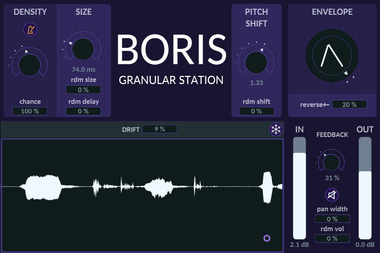

# BORIS Granular Station



**BORIS Granular Station** is a lightweight real-time granulator for **live audio input**. It lets you zoom in on the details of sound and explore its temporal dimension as it flows.

BORIS is **fast** and **precise**: it’s always sample-accurate and adds no extra latency to your FX chain.

### Features

- Granulize incoming audio in real time, with latency minimized based on grain length and pitch shift (often 0 samps!)
- Use the interactive pad on the waveform to set the grain position (x-axis) and its random drift (y-axis)
- Shift the pitch of the grains with a resolution of 1/4th of a semitone
- Use the custom envelope control to smoothly morph between different shapes
- Freeze the incoming audio at any time
- Play with feedback — but be warned: since the granuator output can vary drastically, results may be unpredictable :)

### Coming soon

- Selection of pitch shifting modes: microtonal resolution / free shift / musical scales
- Simple LP/HP filters
- ...

### Demo Video

https://youtu.be/WWlFgpCR7Ug

---

## Installation

**Download prebuilt binaries from the `install/` folder**:

- **VST3 Plugin**  
  Copy the file `BORIS_Granular_Station.vst3` into your system’s VST3 plugin directory:
  - **Windows:** `C:\Program Files\Common Files\VST3\`
  - **macOS:** `/Library/Audio/Plug-Ins/VST3/`
  
- **Standalone Application**  
  Simply run the `BorisGranularStation.exe` from the same folder — no installation needed.

---

## Building from Source

BORIS Granular Station is a C++ project built with CMake. It uses [JUCE](https://juce.com/) as a submodule and includes the RNBO API directly.

### Prerequisites

- CMake (version 3.15 or newer)
- A C++ compiler
- JUCE (added as a Git submodule)

### Clone the Repository

```bash
git clone --recurse-submodules https://github.com/glesdora/boris-granular-station
```
